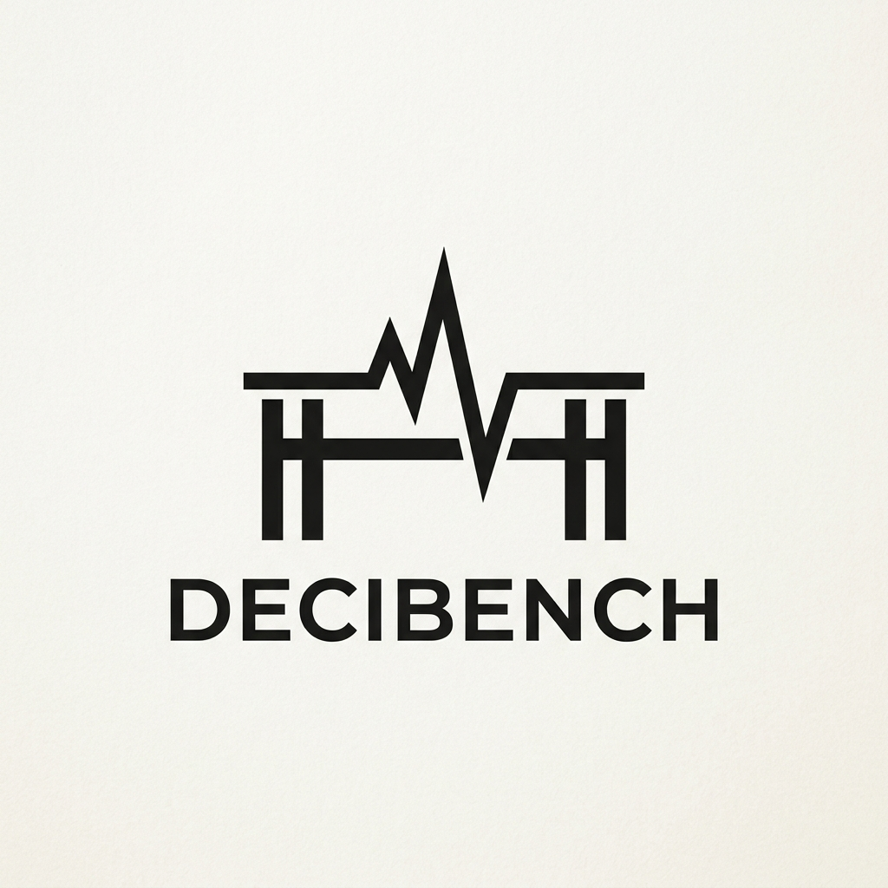

<p align="center">
  
</p>

# Decibench

Local-first voice agent QA for teams that want proof, not vibes.

Decibench lets you run scenario suites, import real calls, replay failures,
and inspect everything locally through a CLI and a local workbench.

> Status: **alpha** (`0.1.0`)
>
> This repo is ready for real evaluation work, but it is still an alpha
> product. Expect active iteration, especially around vendor-specific native
> connectors and advanced integrations.

## What Decibench does today

- Runs benchmark suites against:
  - the built-in `demo` target
  - WebSocket voice agents
  - local `exec:` targets
  - HTTP endpoints
  - bridge-backed Retell and Vapi targets
  - ElevenLabs agents
  - local Twilio Media Streams mocks
- Stores runs locally in SQLite
- Opens a local workbench for runs, failures, imported calls, and replay data
- Imports production calls from JSONL, Retell, and Vapi exports
- Evaluates imported calls and turns failures into regression scenarios
- Supports deterministic scoring plus optional semantic evaluation
- Exposes an optional MCP server for local tool-based workflows

## Install

### Recommended right now

```bash
pipx install git+https://github.com/unforkopensource-org/decibench.git
```

### Direct with `pip`

```bash
python -m pip install git+https://github.com/unforkopensource-org/decibench.git
```

### Local development install

```bash
git clone https://github.com/unforkopensource-org/decibench.git
cd testv1
python -m venv .venv
source .venv/bin/activate
pip install -e .[dev]
```

### About `pipx install decibench`

The short PyPI command is **not** live yet. If you see:

```text
ERROR: Could not find a version that satisfies the requirement decibench
ERROR: No matching distribution found for decibench
```

install from GitHub with one of the commands above.

## First five minutes

This is the zero-key, zero-cost path.

```bash
decibench doctor
decibench init
decibench run --target demo --suite quick --mode deterministic
decibench serve
```

That gives you:

- an environment check
- a local `decibench.toml`
- a deterministic run against the built-in demo target
- a local workbench at [http://127.0.0.1:8000](http://127.0.0.1:8000)

## Common target examples

```bash
decibench run --target demo --suite quick --mode deterministic
decibench run --target ws://localhost:8000/ws --suite quick
decibench run --target 'exec:python my_agent.py' --suite quick
decibench run --target http://localhost:8080/invoke --suite quick
decibench run --target elevenlabs://your_agent_id --suite quick
decibench run --target retell://your_agent_id --suite quick
decibench run --target vapi://your_agent_id --suite quick
decibench run --target twilio://localhost:3000/media-stream --suite quick
```

## Semantic evaluation

Decibench supports four semantic-evaluation providers today:

- `ollama` for free local evaluation
- `openai`
- `anthropic`
- `gemini`

### Free local evaluation with Ollama

1. Install Ollama from the official download page or install script.
2. Pull a local model.
3. Tell Decibench to use the Ollama preset.

```bash
ollama pull llama3.2:3b
ollama serve
decibench models preset ollama balanced
decibench run --target demo --suite quick --mode semantic-local
```

### Cloud evaluation

```bash
decibench auth set openai
decibench models preset openai balanced
decibench run --target demo --suite quick --mode semantic
```

Swap `openai` for `anthropic` or `gemini` if you prefer.

## Native vendor connectors

Retell and Vapi native targets use the local bridge sidecar.

```bash
decibench bridge install
decibench doctor
decibench run --target retell://your_agent_id --suite quick
```

This stays local. The bridge exists because those vendors require a browser
SDK or browser-like session handling.

## MCP server

Decibench ships an MCP entry point, but the MCP dependency is optional.

### Reliable MCP install path

```bash
python -m pip install "decibench[mcp] @ git+https://github.com/unforkopensource-org/decibench.git"
decibench-mcp --help
```

### Run it

```bash
decibench-mcp
decibench-mcp --transport sse --port 8090
```

Use MCP when you want a local agent client such as Claude Code, Cursor, or
another MCP-capable tool to call Decibench commands as tools instead of
shelling out manually.

## Command overview

| Command | What it is for |
| --- | --- |
| `decibench init` | Create `decibench.toml` for the current project |
| `decibench doctor` | Check install, config, workbench, keys, and targets |
| `decibench run` | Run a suite or one scenario |
| `decibench serve` | Launch the local workbench |
| `decibench auth` | Store, test, list, and remove provider keys |
| `decibench models` | Pick a semantic provider or model |
| `decibench import` | Import production calls |
| `decibench evaluate-calls` | Grade imported calls |
| `decibench replay` | Inspect an imported call or convert it to a scenario |
| `decibench runs` | Inspect stored runs and evaluations |
| `decibench scenario` | List, validate, or schema-check scenarios |
| `decibench scoring` | Change weights and metric policies |
| `decibench compare` | Compare two targets side by side |
| `decibench bridge` | Install and inspect the local native bridge |
| `decibench version` | Show version and environment info |
| `decibench-mcp` | Run the optional MCP server |

## Where to read next

- [userinfo.md](userinfo.md) - the practical user manual
- [docs/README.md](docs/README.md) - the docs map
- [docs/install.md](docs/install.md) - install details
- [docs/quickstart.md](docs/quickstart.md) - first-run walkthrough
- [docs/websocket-testing.md](docs/websocket-testing.md) - WebSocket guidance
- [docs/import-and-evaluate.md](docs/import-and-evaluate.md) - offline QA loop
- [docs/native-connectors.md](docs/native-connectors.md) - bridge-backed vendors

## Maintainer notes vs user docs

This repo also contains maintainer-facing notes such as:

- `architecture.md`
- `plan.md`
- `currentbug.md`
- `prod.md`
- `techimplemntation.md`
- `versionmanagement.md`

Those are useful for contributors and planning, but first-time users can
ignore them and start with `README.md`, `userinfo.md`, and `docs/`.

## License

Apache-2.0
