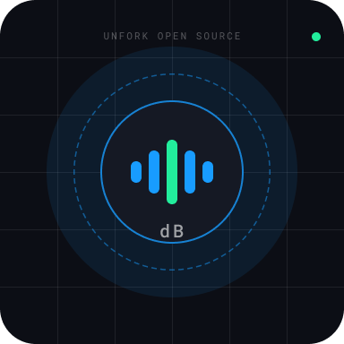

<div align="center">
  <br />
  <picture>
    
  </picture>
  <br />
  <h1><b>Decibench</b></h1>
  <p><b>Unit Testing for the Voice AI Era</b></p>
  
  <p>
    <a href="https://github.com/unforkopensource-org/decibench/actions"></a>
    <a href="https://pypi.org/project/decibench/"></a>
    <a href="https://github.com/unforkopensource-org/decibench/blob/main/LICENSE"></a>
  </p>

  <p>
    <i>Simulate thousands of concurrent calls • Detect 100% of hallucinations • Score latency down to the millisecond</i>
  </p>
</div>

<br />

---

## ⚡ Why Decibench?

Building a voice AI agent is easy. Getting it to production without it hallucinating, lagging, or failing during interruptions is incredibly hard. For mission-critical agents in healthcare, banking, or real estate, manual testing simply doesn't scale.

Decibench is a **local-first** testing platform designed specifically for the complexities of Voice AI. 

Instead of making manual phone calls, Decibench allows your engineering team to:
- 📞 **Simulate thousands of concurrent calls** locally or in CI/CD.
- ⏱️ **Measure Latency** with pinpoint millisecond accuracy (p50/p90 targets).
- 🧠 **Detect Hallucinations** using semantic LLM-as-a-Judge grading.
- 🛑 **Ensure Compliance** and handle hostile user interruptions.

<br />

<div align="center">
  
</div>

---

## 🧠 3 Powerful Testing Modes

Whether you are testing an internal script or evaluating a deep conversational agent, Decibench scales with your workflow.

### 1️⃣ Deterministic (`--mode deterministic`)
Fast, rigid, free string-matching tests. Perfect for ensuring specific keywords, disclaimers, or exact greetings are present.
*Runs entirely locally. 0 API costs.*

### 2️⃣ Semantic (`--mode semantic`)
Slower, nuanced testing using an LLM Judge (e.g. `gpt-4o`). The judge scores the agent on conversational accuracy, compliance, and hallucination rates based on strict guidelines.
*Essential for testing complex multi-turn logic.*

### 3️⃣ RAG-Augmented (`--mode semantic+rag`)
The ultimate stress test. Upload your PDF training documents or knowledge bases, and Decibench will **auto-generate adversarial test suites** based on your own documentation to actively try and break your agent.

---

## 🚀 Quick Start

### Installation
Decibench is built in Python but supports any Voice Agent endpoint.

```bash
# Install the CLI tool
pip install decibench

# Install the optional headless browser sidecar for Telephony bridging
npm install -g decibench-bridge
```

### Run Your First Suite
Create a `decibench.toml` configuration file in your project root, then simply run:

```bash
# Run a quick suite locally against your Vapi/Retell agent
decibench run target=vapi suite=quick

# View the beautiful dashboard to debug failures
decibench serve
```

---

## 🛡️ Secure & Local-First

Decibench is built for the enterprise. 
- **Zero Telemetry**: We do not track your tests.
- **Privacy Redaction Engine**: Automatically scrubs API keys (`sk-...`), SSNs, Credit Cards, and passwords from your test payloads before saving them to the local SQLite database.
- **Local SQLite DB**: Your proprietary call transcripts never leave your machine unless you explicitly export them.

---

## 🤝 Unfork Open Source

Decibench is proudly built and maintained by **[Unfork Open Source](https://github.com/unforkopensource-org)**. 

Our mission is to empower developers with high-performance, developer-first AI infrastructure. If you love this project, please consider giving it a ⭐ on GitHub!

<div align="center">
  <br />
  <p>Built with precision by developers, for developers.</p>
</div>
